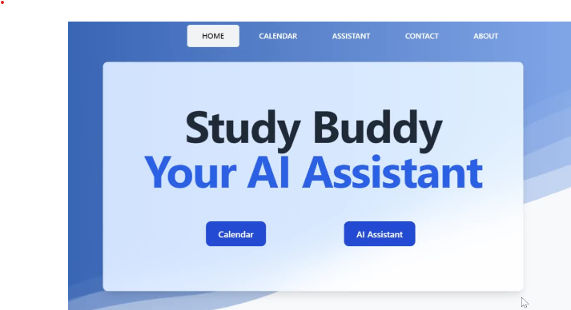
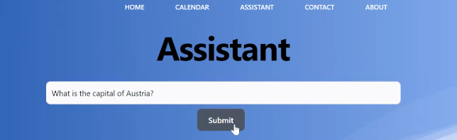
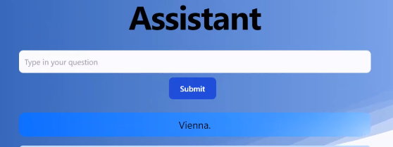

# StudyBuddyAI

## Deployed page 

https://study-buddy-ai.netlify.app/ 

## User Story

As a student, I want to use Study Buddy to create my personalized study assistant whom I can ask questions and get help with my studies. When I visit the Study Buddy website, I can create a new study room by entering a room name and creating a subject I need help with. Once I'm in the study room, I can ask Study Buddy questions related to the subject and receive helpful answers. I can also use the search and instructions page to look up information and get step-by-step instructions for solving problems. As I make progress in my studies, Study Buddy updates my Google Calendar with milestones and achievements, so I can track my progress over time. With Study Buddy, I have a personalized study companion that helps me stay on track and achieve my academic goals.

## Technologies used

## Usage

When the user opens the page they will be met with a large text displaying 'Study Buddy Your AI Assistant' along with two button beneath, one which says 'Calendar' and the other 'AI Assistant'.

Once the user clicks the AI Assitant button they will be redirected to a search bar which will state 'Type in your question'. 

When the user types in a question, for example 'What is the Capital of Austria?' and clicks the submit button, their question will be answered and also displayed below the submit button as shown in the image below.

When clicking the 'Calendar' button this is what the user will be met with shown below 

## Acceptance Criteria

- Use React.

- Use Node.js.

- Have both GET and POST routes for retrieving and adding new data.

- Be deployed using Netlify.

- Use at least two libraries, packages, or technologies that we haven't discussed.

- Have a polished front end/UI.

- Meet good quality coding standards (indentation, scoping, naming).

- Have a quality README (with unique name, description, technologies used screenshot, and link to deployed application).

# Credits

## Collaborators

Inna: https://github.com/innonka
Khoubaib: https://github.com/khoubaib-m
Abel: https://github.com/able24
Oluwakemi: https://github.com/kemocares

## APIs used

OpenAI API: https://platform.openai.com/overview
